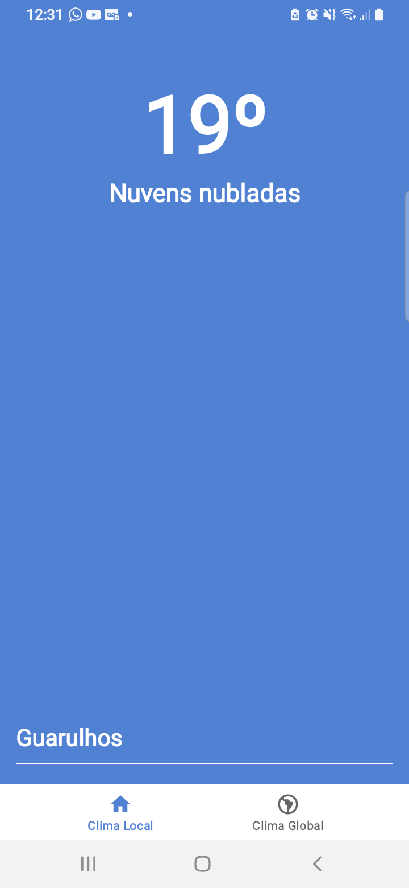
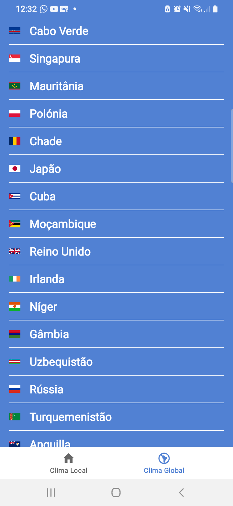
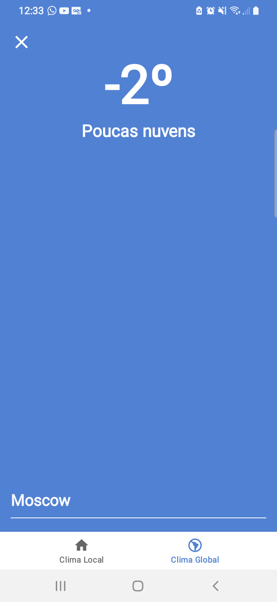

<h1 align="center">App Clima</h1>

<p align="center">
  <a href="https://opensource.org/licenses/Apache-2.0"></a>
  <a href="https://android-arsenal.com/api?level=21"></a>
  <br>
  <a href="https://wa.me/+5511961422254"></a>
  <a href="https://www.linkedin.com/in/rubens-francisco-125529162/"></a>
  <a href="mailto:rubens_assis@outlook.com.br"></a>
</p>

<p align="center">  

⭐ Esse é um projeto para demonstrar meu conhecimento técnico no desenvolvimento Android nativo com Kotlin. Mais informações técnicas abaixo.

⛅ Aplicativo que mostra o clima atual da localidade onde a pessoa se encontra ou o clima de uma capital de algum país.

</p>

</br>

<p float="left" align="center">



</p>

## Download
Faça o download da <a href="apk/app-debug.apk?raw=true">APK diretamente</a>. Você pode ver <a href="https://www.google.com/search?q=como+instalar+um+apk+no+android">aqui</a> como instalar uma APK no seu aparelho android.

## Tecnologias usadas e bibliotecas de código aberto

- Minimum SDK level 21
- [Linguagem Kotlin](https://kotlinlang.org/)

- Componentes da SDK do android que foram utilizados:
  - Navigation: Navegar entre os fragments de maneira fácil e intuitiva com o gerenciamento automático da
  backstack, escolha de destinos de cada fragment, passagem entre telas com animações, etc.
  - Fragment: Os fragments facilitam a separação dos componentes da sua UI, seguem o seu ciclo de vida próprio e o ciclo de vida da activity na qual ele reside sendo uma ótima alternativa para organizar melhor suas UIs.
  - Dagger Hilt: Biblioteca para injeção de dependências de forma automática, centraliza as dependências que você vai precisar injetar ao longo do seu app e possibilita a criação de singletons que são instanciados uma unica vez e são passados para as classes que necessitam dele.
  - Lifecycle: Observa os ciclos de vida do Android e permite a alteração da UI de acordo com o ciclo de vida.
  - ViewModel: Faz a ponte entre a UI e a camada de dados e permite que as telas do seu app sobreviva a alterações de configuração, como as que acontecem quando a tela é rotacionada.
  - ViewBinding: Liga os componentes do XML no Kotlin através de uma classe que pode ser usada para inflar os componentes da sua view e manipulá-los na sua activity ou fragment.

- Arquitetura 
  - MVVM (View - ViewModel - Model)
  - Comunicação da ViewModel com a View através de LiveData e Observers
  - Repositories para abstração da comunidação com a camada de dados.
  
- Bibliotecas 
  - [Play Services Location](https://mvnrepository.com/artifact/com.google.android.gms/play-services-location?repo=google): Biblioteca do google para lidar com geolocalização.
  - [Retrofit](https://square.github.io/retrofit/): Biblioteca para fazer requisições HTTP para APIs.
  - [Gson Converter](https://github.com/square/retrofit/tree/master/retrofit-converters/gson): Biblioteca para converter objetos JSON em objetos JAVA compreendíveis no Android Studio.
  - [okHttp Logging Interceptor](https://github.com/square/okhttp/tree/master/okhttp-logging-interceptor): Biblioteca que serve para obter Logs mais detalhados das requisições HTTPs.
  - [Picasso](https://square.github.io/picasso/): Biblioteca para carregar imagens através da url e armazená-las em cache.
  - [Firebase Analytics](https://firebase.google.com/docs/analytics): Biblioteca para obter estatísticas úteis sobre o uso do app.
  - [Firebase CrashLytics](https://firebase.google.com/docs/crashlytics): Biblioteca para obter relatórios de erros que ocorrem na execução do app.

## Arquitetura
APRESENTE A ARQUITETURA UTILIZADA NO PROJETO
**Nome do aplicativo** utiliza a arquitetura MVVM e o padrão de Repositories, que segue as [recomendações oficiais do Google](https://developer.android.com/topic/architecture).
</br></br>
ADICIONE UM FLUXOGRAMA DA ARQUITETURA UTILIZADA - https://excalidraw.com/
<br>

## API de terceiros

COLOQUE O NOME, LINK E DESCRIÇÃO DAS APIS UTILIZADAS NO PROJETO

## Features

### Feature 1


Texto de exemplo

### Feature 2


Texto de Exemplo.

# Licença

COLOQUE A LICENÇA - https://opensource.org/licenses

```xml

```
